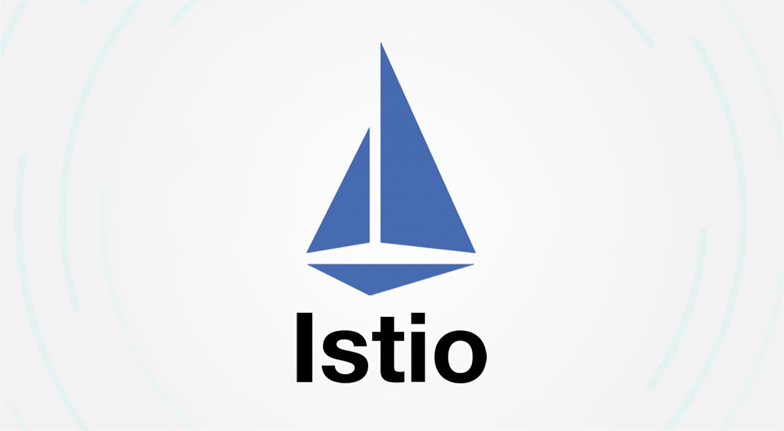

### **Overview of Istio**

Istio is an open-source service mesh that helps manage microservices and their communication within a Kubernetes environment. It provides advanced features like traffic management, security, monitoring, and observability. Istio simplifies the process of managing complex microservice architectures by providing tools to control and secure inter-service communication.

### **Core Components of Istio**

1. **Envoy Proxy**: Istio deploys a sidecar proxy (Envoy) alongside each service instance. This proxy handles all communication between services, providing load balancing, security, and traffic management features.
   
2. **Istiod**: The Istiod component is the control plane that manages configuration and distributes it to the sidecars (Envoy proxies) in the mesh.

3. **Istio Gateway**: A specialized load balancer designed to handle ingress and egress traffic for services in the Istio mesh. It provides features like traffic routing, TLS termination, and access control.

### **Key Features of Istio**

1. **Traffic Management**:
   - Istio enables fine-grained control over traffic routing, which is essential for scenarios like canary releases, blue-green deployments, traffic shifting, and retries. You can control how traffic flows between microservices based on several conditions such as headers, weights, and more.

2. **Security**:
   - Istio provides built-in security features such as mutual TLS (mTLS) for encrypted communication, authentication, and authorization policies to secure microservices. This helps in ensuring that only authorized services can communicate within the mesh.

3. **Observability**:
   - Istio offers powerful tools to observe the health of the microservices, track requests, and monitor metrics like response times and error rates. This is achieved using integration with tools like Prometheus, Grafana, and Jaeger for tracing.

4. **Policy Enforcement**:
   - Istio allows defining and enforcing policies, including rate limiting, access control, and retries. Policies can be applied across services in the mesh to ensure compliance with security and performance standards.

### **Understanding Istio Commands**

1. **`istioctl install`**:
   - This command installs Istio in a Kubernetes cluster. It ensures that all necessary Istio components (such as Envoy proxies and Istiod) are deployed and configured.

2. **`istioctl manifest generate`**:
   - This command generates the Istio manifest files. You can customize the configuration before installing Istio.

3. **`istioctl upgrade`**:
   - Used to upgrade an existing Istio installation to a new version. It helps keep your Istio mesh up-to-date with the latest features and fixes.

4. **`istioctl proxy-status`**:
   - This command helps in checking the status of proxies in the mesh. It provides information about the synchronization of sidecar proxies with the control plane, which is important for troubleshooting.

5. **`istioctl proxy-config`**:
   - This is used to inspect the configuration of the Envoy proxy. You can query information about clusters, listeners, routes, and more. This helps in debugging and troubleshooting traffic routing issues.

6. **`kubectl apply -f istio-ingressgateway.yaml`**:
   - A Kubernetes command that applies the Istio ingress gateway configuration. The ingress gateway is responsible for handling external traffic coming into the mesh.

7. **`kubectl get svc istio-ingressgateway`**:
   - This command is used to retrieve the status of the Istio ingress gateway service. It helps in determining the external IP or DNS endpoint that can be used to access services in the mesh.

### **Common Istio Use Cases**

1. **Traffic Routing**:
   - Istio allows traffic routing based on several parameters like headers, paths, or HTTP methods. It is commonly used for scenarios like canary deployments, load balancing, or migrating traffic between services without downtime.

2. **Service-to-Service Security**:
   - By enabling mutual TLS (mTLS), Istio ensures secure communication between services in the mesh. It ensures that data is encrypted and that only authorized services can communicate with each other.

3. **Monitoring and Tracing**:
   - Istio provides rich observability tools. With integration with tools like Prometheus for metrics, Jaeger for tracing, and Grafana for visualization, you can get insights into the health and performance of your services.

4. **Rate Limiting and Access Control**:
   - You can define rate limits to prevent a service from being overwhelmed and implement access control policies to ensure only specific services or users can access particular services.

5. **Fault Injection**:
   - Istio allows injecting faults like delays or HTTP errors into requests to simulate network failures or service issues. This is useful for testing the resiliency of services.

### **Best Practices for Istio**

- **Use mTLS**: Always enable mutual TLS to secure communication between services. This ensures that data in transit is encrypted and services authenticate each other.
- **Define Traffic Policies**: Use Istio’s traffic management features to define traffic shifting, retries, and fault tolerance strategies.
- **Monitor and Trace**: Utilize Istio’s observability tools for monitoring service health, analyzing traffic patterns, and debugging issues.
- **Keep Configurations Clean**: Be mindful of the complexity of Istio’s configurations. It's easy to accumulate multiple routing rules and security policies, so it’s important to manage and organize them efficiently.

### **Conclusion**

Istio plays a crucial role in managing modern microservices architectures by providing advanced features such as traffic management, security, monitoring, and policy enforcement. It simplifies the complexities of microservice communication, ensuring that services are secure, reliable, and observable. By using Istio’s powerful tools and commands, you can take full control over the behavior of your microservices and ensure their efficient operation.

### **Official Documentation Links**

1. **[Istio Official Documentation](https://istio.io/docs/)**:
   - The main source of documentation for Istio, including installation, configuration, traffic management, observability, and security.

2. **[Istio Installation Guide](https://istio.io/docs/setup/)**:
   - A detailed guide on installing Istio on different platforms like Kubernetes, virtual machines, or using Istio's `istioctl` command.

3. **[Traffic Management in Istio](https://istio.io/docs/concepts/traffic-management/)**:
   - Learn how Istio manages traffic and how to configure routing, retries, and fault injection.

4. **[Security with Istio](https://istio.io/docs/concepts/security/)**:
   - Official guide to Istio's security model, including mutual TLS, authentication, and authorization.

5. **[Monitoring with Istio](https://istio.io/docs/tasks/observability/)**:
   - Overview of monitoring tools integrated with Istio for metrics, tracing, and logs using Prometheus, Grafana, and Jaeger.

6. **[Istio CLI Reference](https://istio.io/docs/reference/commands/)**:
   - Detailed reference for Istio's CLI commands like `istioctl` and other tools you can use for managing your Istio environment.

7. **[Istio Networking Concepts](https://istio.io/docs/concepts/networking/)**:
   - Deep dive into Istio’s networking capabilities, including services, virtual services, and destination rules.

8. **[Istio Telemetry](https://istio.io/docs/tasks/observability/telemetry/)**:
   - Provides steps for enabling telemetry and gathering application performance data.
