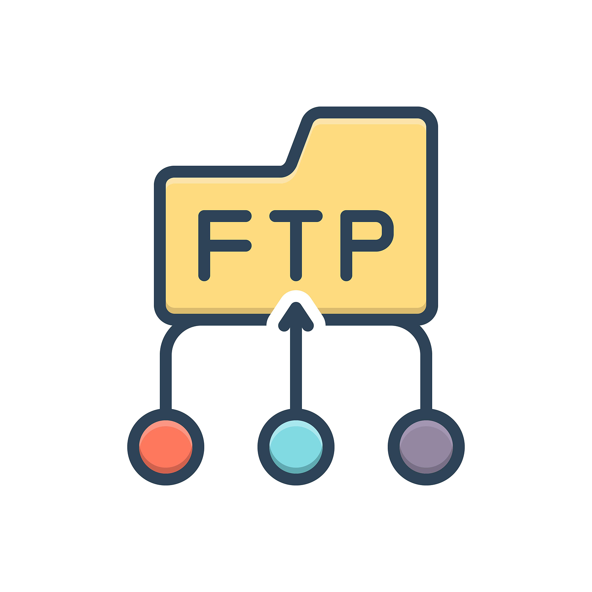

Here are the basic **FTP server** and **FTP client** commands:

---

### **FTP Server Commands** (for managing vsftpd or any FTP server)

1. **Install FTP Server (vsftpd)**

   On Ubuntu/Debian-based systems:
   ```bash
   sudo apt-get update
   sudo apt-get install vsftpd
   ```

2. **Start FTP Service**
   ```bash
   sudo systemctl start vsftpd
   ```

3. **Enable vsftpd to Start on Boot**
   ```bash
   sudo systemctl enable vsftpd
   ```

4. **Check vsftpd Status**
   ```bash
   sudo systemctl status vsftpd
   ```

5. **Stop vsftpd Service**
   ```bash
   sudo systemctl stop vsftpd
   ```

6. **Restart vsftpd Service**
   ```bash
   sudo systemctl restart vsftpd
   ```

7. **Configure vsftpd (Edit Configuration File)**
   ```bash
   sudo nano /etc/vsftpd.conf
   ```

8. **Test FTP Server Connection**
   ```bash
   ftp <hostname_or_IP_address>
   ```

---

### **FTP Client Commands** (for connecting, uploading, and downloading files)

1. **Connect to an FTP Server**
   ```bash
   ftp <hostname_or_IP_address>
   ```
   Example:
   ```bash
   ftp ftp.example.com
   ```

2. **Login to the FTP Server**
   ```bash
   Name (ftp.example.com:username): <username>
   Password: <password>
   ```

3. **List Files in the Current Directory**
   ```bash
   ls
   ```

4. **Change Directory on the FTP Server**
   ```bash
   cd <directory_name>
   ```

5. **Upload a File to the FTP Server**
   ```bash
   put <local-file>
   ```
   Example:
   ```bash
   put myfile.txt
   ```

6. **Download a File from the FTP Server**
   ```bash
   get <remote-file>
   ```
   Example:
   ```bash
   get example.txt
   ```

7. **Create a Directory on the FTP Server**
   ```bash
   mkdir <directory_name>
   ```

8. **Delete a File on the FTP Server**
   ```bash
   delete <remote-file>
   ```

9. **Rename a File on the FTP Server**
   ```bash
   rename <old-name> <new-name>
   ```

10. **List the Remote Directory**
    ```bash
    dir
    ```

11. **Change Local Directory**
    ```bash
    lcd <local-directory>
    ```

12. **Put Multiple Files in a Batch**
    ```bash
    mput <file-pattern>
    ```
    Example:
    ```bash
    mput *.txt
    ```

13. **Get Multiple Files in a Batch**
    ```bash
    mget <file-pattern>
    ```
    Example:
    ```bash
    mget *.jpg
    ```

14. **Exit the FTP Session**
    ```bash
    bye
    ```

15. **Close FTP Session (Without Exit)**
    ```bash
    quit
    ```

16. **Check Current FTP Session Information**
    ```bash
    status
    ```

---

### **Additional FTP Server Configuration Commands** (for advanced setup)

1. **Change Passive Mode Configuration**
   Edit the `vsftpd.conf` file and set the following:
   ```bash
   pasv_enable=YES
   pasv_min_port=10000
   pasv_max_port=10100
   ```

2. **Restart FTP Server to Apply Changes**
   ```bash
   sudo systemctl restart vsftpd
   ```
