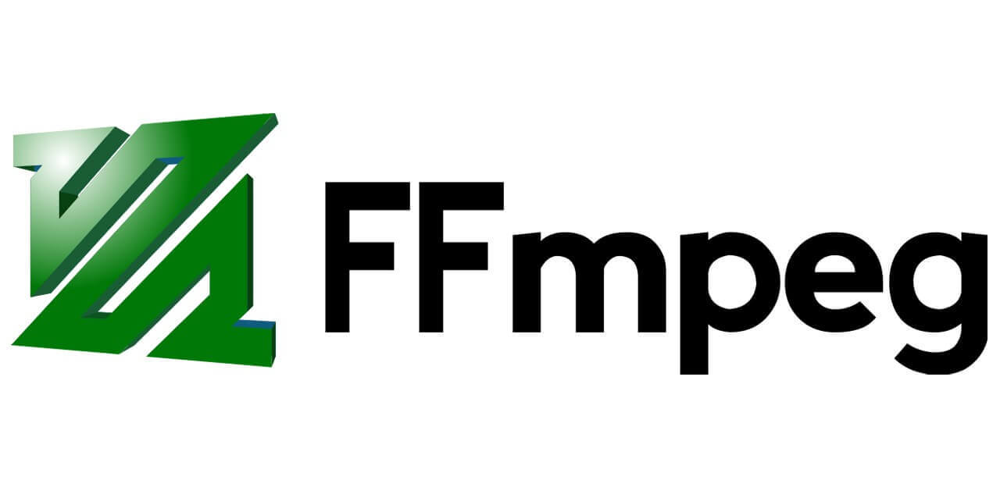

### **FFmpeg-Based Streaming Servers**

#### **Overview**

FFmpeg is a powerful multimedia framework used for handling video, audio, and other multimedia files and streams. It can be used as the backbone of many streaming servers to transcode, stream, and record media content in real-time. FFmpeg is widely used for its ability to convert media formats, stream content over networks, and support a variety of streaming protocols such as RTMP (Real-Time Messaging Protocol), HLS (HTTP Live Streaming), and DASH (Dynamic Adaptive Streaming over HTTP).

**FFmpeg-based streaming servers** are typically used for live streaming or video-on-demand applications. They offer support for a wide range of input sources (files, live captures, webcams) and can convert and stream the content to various destinations and platforms, including custom media servers, YouTube, Twitch, and other platforms that support RTMP.

#### **Key Features of FFmpeg-Based Streaming Servers**
1. **Live Streaming:** FFmpeg allows the streaming of live video feeds from webcams, live cameras, or files to streaming platforms or custom servers.
2. **Transcoding and Format Conversion:** FFmpeg can transcode incoming media into various formats and resolutions, such as converting a video into a streamable HLS format.
3. **Multi-Protocol Support:** FFmpeg supports multiple streaming protocols, including RTMP, HLS, and DASH.
4. **Multimedia Editing:** FFmpeg provides advanced video editing features, such as trimming, adding filters, changing resolution, and more.
5. **Real-Time Processing:** FFmpeg can be used for real-time encoding, decoding, and transcoding of video/audio data, making it ideal for live streaming scenarios.

#### **Popular Use Cases**

1. **Live Streaming Platforms:** FFmpeg can be used to stream live video to platforms like YouTube, Facebook, or custom RTMP servers.
2. **Video On-Demand (VoD) Streaming:** Transcoding videos into formats suitable for adaptive streaming protocols like HLS or DASH.
3. **Online Conferencing and Webinars:** Using FFmpeg for live video encoding and broadcasting on platforms like Zoom, Twitch, or custom setups.
4. **Surveillance:** Streaming video feeds from security cameras to web applications.
5. **Gaming and eSports Streaming:** Platforms like Twitch and YouTube use FFmpeg for transcoding and real-time streaming of live gaming sessions.

#### **Streaming Protocols Supported by FFmpeg**
- **RTMP (Real-Time Messaging Protocol):** Popular for live streaming due to its low latency and reliability.
- **HLS (HTTP Live Streaming):** Ideal for delivering adaptive bitrate streams over HTTP. Supports a variety of devices (smartphones, tablets, computers).
- **DASH (Dynamic Adaptive Streaming over HTTP):** Similar to HLS but more advanced, it allows for adaptive bitrate streaming and is supported by major platforms like YouTube.

#### **How FFmpeg is Used in Streaming Servers**
1. **Encoding & Streaming:**
   - FFmpeg can receive a live video stream, process it (encode, transcode), and push it to a streaming destination using protocols like RTMP, RTSP, or HLS.
   
2. **Live Broadcast with FFmpeg:**
   - For example, using FFmpeg to stream a live feed to an RTMP server:
     ```bash
     ffmpeg -i input_video.mp4 -f flv rtmp://<server_address>/live/stream
     ```

3. **Transcoding for Adaptive Streaming (HLS):**
   - FFmpeg can segment video files into smaller chunks for HLS and generate the necessary manifest (M3U8) files:
     ```bash
     ffmpeg -i input_video.mp4 -c:v libx264 -preset fast -profile:v baseline -maxrate 500k -bufsize 1000k -hls_time 10 -hls_list_size 0 -f hls output.m3u8
     ```

#### **Popular FFmpeg-Based Streaming Servers**
1. **Nginx with RTMP Module**:
   - Nginx with the RTMP module is a popular combination for FFmpeg-based live streaming servers. The RTMP module allows you to accept live video streams via RTMP and broadcast them to viewers using various protocols (HLS, DASH).
   - [Nginx RTMP Module Documentation](https://github.com/arut/nginx-rtmp-module)

2. **Wowza Streaming Engine**:
   - A popular media server solution that integrates FFmpeg for transcoding and streaming, with support for live and on-demand video.
   - [Wowza Streaming Engine Documentation](https://www.wowza.com/docs/wowza-streaming-engine)

3. **Red5 Pro**:
   - A media server software built on top of FFmpeg, supporting real-time streaming, transcoding, and recording.
   - [Red5 Pro Documentation](https://red5pro.com/docs/)

4. **OBS Studio** (Open Broadcaster Software):
   - OBS is a free, open-source software that uses FFmpeg for encoding and streaming. It’s often used by streamers to broadcast live video to services like YouTube, Twitch, or custom RTMP servers.
   - [OBS Studio Documentation](https://obsproject.com/help)

#### **Links for Additional Information**
- [FFmpeg Official Documentation](https://ffmpeg.org/documentation.html)
- [Nginx RTMP Module GitHub](https://github.com/arut/nginx-rtmp-module)
- [Live Streaming with FFmpeg](https://trac.ffmpeg.org/wiki/Streaming)
- [Wowza Streaming Engine Docs](https://www.wowza.com/docs/wowza-streaming-engine)
- [Red5 Pro Documentation](https://red5pro.com/docs/)
- [OBS Studio Help](https://obsproject.com/help)

FFmpeg-based streaming servers offer a powerful and flexible solution for real-time streaming, and they are widely used for both professional and personal streaming applications. By understanding FFmpeg’s capabilities and integrating it into a streaming server setup, you can deliver high-quality streams to various audiences and platforms.