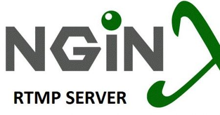

### **1. Start/Stop NGINX Server**

- **Start NGINX:**
   ```bash
   sudo systemctl start nginx
   ```
   This command starts the NGINX server, allowing it to handle RTMP and HTTP traffic.

- **Stop NGINX:**
   ```bash
   sudo systemctl stop nginx
   ```
   This stops the NGINX server.

- **Restart NGINX (after configuration changes):**
   ```bash
   sudo systemctl restart nginx
   ```
   This is used after making changes to the `nginx.conf` file, like adding a new RTMP application or changing streaming settings.

- **Check NGINX Status:**
   ```bash
   sudo systemctl status nginx
   ```
   This checks the status of the NGINX service, including whether it's running or inactive.

---

### **2. Push Stream to NGINX RTMP Server**

To stream video from a source to your RTMP server:

- **Using FFmpeg to Push Stream**:
   ```bash
   ffmpeg -i input_video.mp4 -f flv rtmp://localhost/live/stream
   ```
   - `input_video.mp4` is the local video file you want to stream.
   - `rtmp://localhost/live/stream` is the RTMP endpoint on the NGINX server. This stream can be accessed by clients.

---

### **3. Pull Stream from NGINX RTMP Server**

To pull the stream from the RTMP server to forward it elsewhere or play it:

- **Using FFmpeg to Pull Stream**:
   ```bash
   ffmpeg -i rtmp://localhost/live/stream -c copy -f flv rtmp://another_server/live/stream
   ```
   - This command pulls the stream from `localhost/live/stream` and forwards it to `another_server/live/stream`.

---

### **4. Record Streams**

To enable stream recording, you must configure it in the `nginx.conf` file. Here's how to record streams using the RTMP module:

- **Configure Stream Recording in `nginx.conf`:**
   ```nginx
   application live {
       live on;
       record all;
       record_path /tmp/recordings;
       record_unique on;
   }
   ```
   - This configuration will save the streams being broadcasted to `/tmp/recordings`.

- **Start Streaming with Recording:**
   Once the NGINX configuration is updated, restart NGINX:
   ```bash
   sudo systemctl restart nginx
   ```

---

### **5. Stream to HLS (HTTP Live Streaming)**

To stream live content as HLS using NGINX, you must enable the HLS option in the `nginx.conf` configuration.

- **Enable HLS in `nginx.conf`:**
   ```nginx
   application live {
       live on;
       hls on;
       hls_path /tmp/hls;
       hls_fragment 3s;
   }
   ```
   - This configuration enables HLS streaming and stores the fragments in `/tmp/hls`.
   - The stream will be accessible at `http://your_server_address/hls/stream.m3u8`.

- **Start Streaming with HLS**:
   Push a stream to NGINX using FFmpeg:
   ```bash
   ffmpeg -i input_video.mp4 -f flv rtmp://localhost/live/stream
   ```
   - This stream is now available as HLS on `http://your_server_address/hls/stream.m3u8`.

---

### **6. View Stream in Web Browser**

- **HLS Stream URL:**
   After enabling HLS, you can access the stream using a browser or media player:
   ```
   http://your_server_address/hls/stream.m3u8
   ```

---

### **7. Monitor NGINX Logs for RTMP Activity**

You can check the NGINX access logs to monitor incoming streams or view any errors related to the RTMP server.

- **Access Logs:**
   ```bash
   tail -f /var/log/nginx/access.log
   ```
   - This shows incoming requests to your server, including RTMP and HLS requests.

- **Error Logs:**
   ```bash
   tail -f /var/log/nginx/error.log
   ```
   - This shows errors if there are any issues with the RTMP or HLS setup.

---

### **8. Common FFmpeg Commands for RTMP Streaming**

- **Push Stream to RTMP Server (from a webcam):**
   ```bash
   ffmpeg -f v4l2 -i /dev/video0 -f flv rtmp://localhost/live/stream
   ```
   - This pushes a live webcam stream from `/dev/video0` to the NGINX RTMP server.

- **Push Audio Stream:**
   ```bash
   ffmpeg -f alsa -i hw:0 -f flv rtmp://localhost/live/stream
   ```
   - This command pushes an audio-only stream from the system's microphone to the RTMP server.

---

### **Additional Links**

- **NGINX RTMP Module GitHub Repository**: [https://github.com/arut/nginx-rtmp-module](https://github.com/arut/nginx-rtmp-module)
- **NGINX RTMP Streaming Setup Guide**: [https://www.scaleway.com/en/docs/setup-a-live-streaming-server-using-nginx-rtmp/](https://www.scaleway.com/en/docs/setup-a-live-streaming-server-using-nginx-rtmp/)
- **FFmpeg Documentation**: [https://ffmpeg.org/documentation.html](https://ffmpeg.org/documentation.html)

