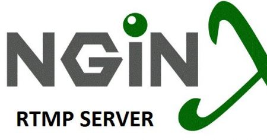

### **NGINX RTMP Module - Theory**

The **NGINX RTMP Module** is an extension to NGINX that provides support for RTMP (Real-Time Messaging Protocol) streaming. RTMP is a widely-used protocol for delivering video content to viewers in real-time, especially for live streaming services like Twitch, YouTube, and Facebook Live.

With the NGINX RTMP module, you can set up a live video streaming server, record streams, or even implement adaptive bitrate streaming for multiple quality levels. This makes it a powerful tool for building custom streaming platforms.

### **Key Features**

1. **Live Streaming**:
   - Supports live RTMP streaming for pushing and pulling streams from sources like cameras, desktop capture tools, or video files.

2. **RTMP to HLS**:
   - Can convert RTMP streams to HLS (HTTP Live Streaming), enabling streaming via HTTP and providing compatibility with most modern browsers and mobile devices.

3. **Stream Recording**:
   - The NGINX RTMP module supports recording live streams and saving them to disk for later use (e.g., video-on-demand, VoD).

4. **Adaptive Bitrate Streaming**:
   - The module supports adaptive bitrate streaming (ABR), which adjusts the stream's quality based on the viewer's internet connection.

5. **Authentication and Access Control**:
   - Provides basic access control, allowing you to restrict access to specific streams based on IP addresses or other criteria.

6. **Low Latency Streaming**:
   - NGINX with RTMP is known for low-latency streaming, which is crucial for real-time broadcasts like gaming or sports events.

7. **Playback in Multiple Formats**:
   - Besides RTMP, it supports HLS, which is compatible with HTML5 video players, making it easier to stream content over the web.

---

### **Setting Up NGINX with RTMP Module**

1. **Install NGINX with RTMP Module**:
   - First, you need to install NGINX with the RTMP module. You can either compile NGINX from source with the RTMP module or use a precompiled package.

   **Install NGINX and RTMP module from source**:
   - Download NGINX and the RTMP module:
     ```bash
     sudo apt-get update
     sudo apt-get install libnginx-mod-rtmp
     ```
   
2. **Configure NGINX for RTMP Streaming**:
   - Once NGINX is installed, you need to configure it to use the RTMP module. Open the `nginx.conf` configuration file for editing:
     ```bash
     sudo nano /etc/nginx/nginx.conf
     ```
   
   - Add the following RTMP configuration within the `http` block or at the root of the config:
     ```nginx
     worker_processes  auto;
     events {
         worker_connections  1024;
     }

     rtmp {
         server {
             listen 1935;
             chunk_size 4096;

             application live {
                 live on;
                 record off;
             }
         }
     }
     ```

   - **Explanation**:
     - `listen 1935;`: The RTMP protocol uses port 1935 by default.
     - `application live {}`: Defines the stream configuration. The stream name will be `live` in this case.

3. **Start or Restart NGINX**:
   - After editing the configuration, save and restart NGINX:
     ```bash
     sudo systemctl restart nginx
     ```

4. **Push Stream to NGINX RTMP Server**:
   - Use FFmpeg or a streaming software like OBS (Open Broadcaster Software) to push a stream to your NGINX RTMP server.
   - Here's an example FFmpeg command to stream a video to NGINX:
     ```bash
     ffmpeg -i input_video.mp4 -f flv rtmp://localhost/live/stream
     ```
   - This will push the `input_video.mp4` file to the `stream` application on the RTMP server.

5. **Pull Stream from NGINX RTMP Server**:
   - You can also pull the stream from the server to broadcast it elsewhere:
     ```bash
     ffmpeg -i rtmp://localhost/live/stream -c copy -f flv rtmp://another_server/live/stream
     ```

6. **Stream to HLS (HTTP Live Streaming)**:
   - You can convert RTMP streams to HLS (which is more compatible with browsers and mobile devices) by adding the following to the configuration:
     ```nginx
     rtmp {
         server {
             listen 1935;
             chunk_size 4096;

             application live {
                 live on;
                 record off;
                 hls on;
                 hls_path /tmp/hls;
                 hls_fragment 3s;
             }
         }
     }
     ```
   - The stream will now be accessible as HLS at `http://your_server_address/hls/stream.m3u8`.

---

### **NGINX RTMP Module Commands**

Below are common commands and configurations used with the NGINX RTMP module:

1. **Start/Stop NGINX Server**:
   - Start NGINX:
     ```bash
     sudo systemctl start nginx
     ```
   - Stop NGINX:
     ```bash
     sudo systemctl stop nginx
     ```
   - Restart NGINX (after configuration changes):
     ```bash
     sudo systemctl restart nginx
     ```

2. **Push Stream to NGINX RTMP Server**:
   - Using FFmpeg:
     ```bash
     ffmpeg -i input_video.mp4 -f flv rtmp://localhost/live/stream
     ```

3. **Pull Stream from NGINX RTMP Server**:
   - Using FFmpeg:
     ```bash
     ffmpeg -i rtmp://localhost/live/stream -c copy -f flv rtmp://another_server/live/stream
     ```

4. **Record Streams**:
   - You can configure NGINX to record the stream to disk. In the `nginx.conf` file, set `record` to `on` in the application block:
     ```nginx
     application live {
         live on;
         record all;
         record_path /tmp/recordings;
         record_unique on;
     }
     ```

---

### **Links for Further Reading**

- **Official NGINX RTMP Module Documentation**: [https://github.com/arut/nginx-rtmp-module](https://github.com/arut/nginx-rtmp-module)
- **NGINX RTMP Streaming Guide**: [https://www.scaleway.com/en/docs/setup-a-live-streaming-server-using-nginx-rtmp/](https://www.scaleway.com/en/docs/setup-a-live-streaming-server-using-nginx-rtmp/)
- **FFmpeg Streaming Documentation**: [https://ffmpeg.org/documentation.html](https://ffmpeg.org/documentation.html)

---

The **NGINX RTMP module** is an excellent choice for creating a live streaming server, allowing you to broadcast and record content with a low-latency setup. By configuring the server to stream via RTMP and convert to HLS, you can serve content to a variety of devices and audiences efficiently.