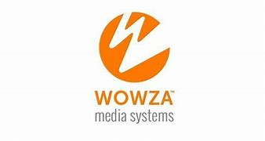

### **Wowza Streaming Engine**

Wowza Streaming Engine is a robust media streaming server that supports live and on-demand streaming for a wide range of devices and protocols. It allows you to stream video content in real-time across any platform, ensuring high-quality delivery at scale.

---

### **Key Features**

- **Multi-Protocol Support:** Wowza supports a variety of streaming protocols, including RTMP, HLS, RTSP, MPEG-DASH, and WebRTC.
- **Live and On-Demand Streaming:** You can stream live content or provide on-demand video delivery.
- **Adaptive Bitrate Streaming (ABR):** Automatically adjusts video quality based on the viewer’s network speed, ensuring smooth playback.
- **Integration with Third-Party Platforms:** Easily integrates with platforms like YouTube, Facebook, and others for live broadcasting.
- **Cloud and On-Premise Deployment:** Available for both cloud-based and on-premise setups.
- **Security Features:** Includes secure streaming with encryption and access control options.

---

### **Common Use Cases**

- **Live Broadcasting:** Live streaming of events, sports, or news.
- **Video on Demand (VOD):** Providing a library of pre-recorded content for streaming.
- **Corporate Video Streaming:** Secure and scalable streaming for corporate environments.
- **Webcasting and Webinars:** Hosting interactive video events with chat and engagement features.
- **Mobile and Web Streaming:** Delivering live video to web and mobile apps seamlessly.

---

### **Setting Up Wowza Streaming Engine**

1. **Download Wowza Streaming Engine:**
   - You can download the software from the official Wowza website: [https://www.wowza.com/](https://www.wowza.com/)
   
2. **Install Wowza:**
   - Follow the installation guide specific to your operating system: [Wowza Installation Guide](https://www.wowza.com/docs/installation-guide)

3. **Configure Wowza Streaming Engine:**
   - Once installed, the configuration files for Wowza Streaming Engine can be found in the `conf/` directory.
   - You can configure live streams, on-demand content, security settings, and more through these files.

4. **Start Wowza Streaming Engine:**
   ```bash
   sudo systemctl start WowzaStreamingEngine
   ```
   - This command starts the Wowza server.

5. **Access Wowza Admin Console:**
   - Open a browser and navigate to `http://<your-server-ip>:8088/`, and log in with your admin credentials.

---

### **Streaming Protocols Supported by Wowza**

- **RTMP (Real-Time Messaging Protocol):** Widely used for live streaming.
- **HLS (HTTP Live Streaming):** Popular for streaming to web browsers and mobile devices.
- **MPEG-DASH:** An alternative to HLS, used for adaptive bitrate streaming.
- **WebRTC:** For low-latency, real-time communication (ideal for video calls or conferences).
- **RTSP (Real-Time Streaming Protocol):** Typically used for surveillance cameras and IP devices.
- **Smooth Streaming:** For Windows-based environments.

---

### **Wowza Commands**

Here are some useful commands for managing and configuring Wowza Streaming Engine:

#### **1. Start/Stop Wowza Streaming Engine**

- **Start Wowza Server:**
   ```bash
   sudo systemctl start WowzaStreamingEngine
   ```
   
- **Stop Wowza Server:**
   ```bash
   sudo systemctl stop WowzaStreamingEngine
   ```

- **Restart Wowza Server:**
   ```bash
   sudo systemctl restart WowzaStreamingEngine
   ```

#### **2. Create a Live Stream Application**

To create a live stream application in Wowza, you will need to configure the `application.xml` file for a custom application.

1. **Navigate to the applications directory:**
   ```bash
   cd /usr/local/WowzaStreamingEngine/content
   ```
   
2. **Create a new directory for the application:**
   ```bash
   mkdir live
   ```

3. **Edit the `application.xml` file:**
   Add the following configuration for live streaming:
   ```xml
   <Application>
       <Name>live</Name>
       <LiveStreamPacketizer>flv</LiveStreamPacketizer>
       <StreamType>live</StreamType>
       <VHost>_defaultVHost_</VHost>
   </Application>
   ```

4. **Restart Wowza Server:**
   ```bash
   sudo systemctl restart WowzaStreamingEngine
   ```

#### **3. Stream to Wowza with FFmpeg**

- **Push a Stream to Wowza:**
   ```bash
   ffmpeg -i input_video.mp4 -f flv rtmp://localhost/live/stream
   ```
   - `input_video.mp4`: Your local video file.
   - `rtmp://localhost/live/stream`: The RTMP stream URL for the Wowza server.

#### **4. Pull Stream from Wowza**

To pull a stream from Wowza and forward it to another server, use FFmpeg:

```bash
ffmpeg -i rtmp://localhost/live/stream -c copy -f flv rtmp://another_server/live/stream
```

---

### **Wowza Official Documentation & Links**

- **Wowza Streaming Engine Documentation:** [https://www.wowza.com/docs](https://www.wowza.com/docs)
- **Wowza Streaming Engine REST API Documentation:** [https://www.wowza.com/docs/wowza-streaming-engine-rest-api](https://www.wowza.com/docs/wowza-streaming-engine-rest-api)
- **Wowza Forum (Community Support):** [https://www.wowza.com/community](https://www.wowza.com/community)
- **Wowza Downloads:** [https://www.wowza.com/downloads](https://www.wowza.com/downloads)

---

### **Troubleshooting & Monitoring**

- **Access Logs:**
   - Wowza stores logs in the `logs/` directory, where you can monitor streaming activity.
   ```bash
   tail -f /usr/local/WowzaStreamingEngine/logs/charon-*.log
   ```

- **Server Health Monitoring:**
   - The Wowza Admin Console provides detailed metrics and health status of your streams, server resources, and connected devices.

---

### **Additional Resources**

- **Wowza Knowledge Base:** [https://www.wowza.com/docs](https://www.wowza.com/docs)
- **Wowza YouTube Channel:** [https://www.youtube.com/user/WowzaMediaSystems](https://www.youtube.com/user/WowzaMediaSystems)

